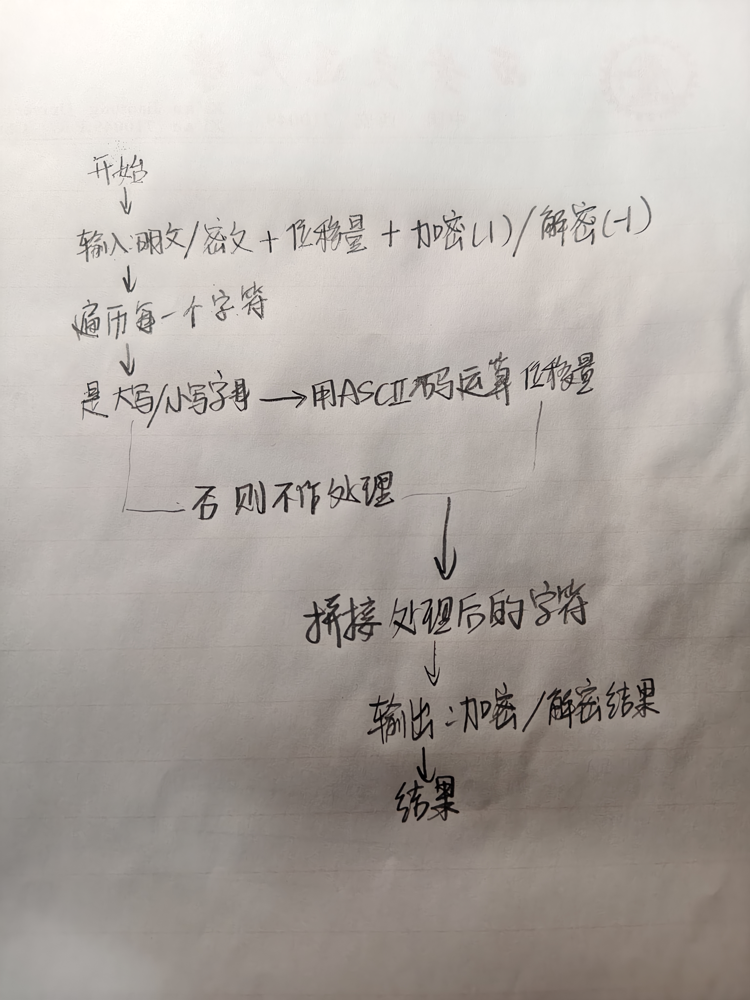

队伍成员 

覃启航2244515141 负责凯撒密码函数的编写，绘制流程图和演示视频

陈恺祺2243415790  负责编写代码主体部分，说明代码

项目简介 
这是一个基于 Python 实现的凯撒密码加解密工具，通过对字母进行固定位移的替换，实现文本的加密与解密功能。非字母字符（如数字、符号、空格）会被原样保留。

功能特性
 
- 支持大写字母、小写字母的位移变换
- 支持**加密（正向位移）与解密（反向位移）**两种模式
- 对非字母字符（如空格、标点、数字）直接保留，不做修改
- 输入校验：确保位移量为非负整数，模式选择为  1 （加密）或  -1 （解密）
 
 
 
程序部署与运行
 
环境要求
 
- Python 3.x 环境（无需额外依赖库）
 
运行步骤
 
1. 将代码保存为  caesar_cipher.py  文件
2. 打开终端/命令行，进入文件所在目录
3. 执行命令：
bash
  
python caesar_cipher.py
 
4. 按提示依次输入：
- 待处理的文本
- 位移量（非负整数）
- 模式选择： 1  代表加密， -1  代表解密

程序流程图

  
模型框架与核心逻辑 
核心函数： caesar_cipher(text, move, a=1) 
 
参数类型说明 
 text   str  待加解密的原始文本 
 move   int  位移量（非负整数） 
 a   int  模式标识： 1 =加密（正向位移）， -1 =解密（反向位移），默认值为  1  
 
核心逻辑
 
1. 若模式为解密（ a=-1 ），则将位移量取反，实现反向位移
2. 遍历文本中每个字符：
- 大写字母： chr((ord(single) - 65 + move) % 26 + 65) 
- 小写字母： chr((ord(single) - 97 + move) % 26 + 97) 
- 非字母字符：直接拼接至结果字符串
3. 返回处理后的完整文本

演示视频
<iframe width="728" height="410" src="//player.bilibili.com/player.html?bvid=BV1h4w2zMEwJ&page=1&high_quality=1&danmaku=0" scrolling="no" border="0" frameborder="no" framespacing="0" allowfullscreen="true"> </iframe>
网址：https://www.bilibili.com/video/BV1h4w2zMEwJ/

涉及到的Python知识点
1.使用for    in   循环语句遍历字符串
2.ord函数将字符转化为ascii码
3.chr函数将ascii码转化为字符
4.input接收输入的字符串，并用int转化为数值
5.用print（f）结构输出
